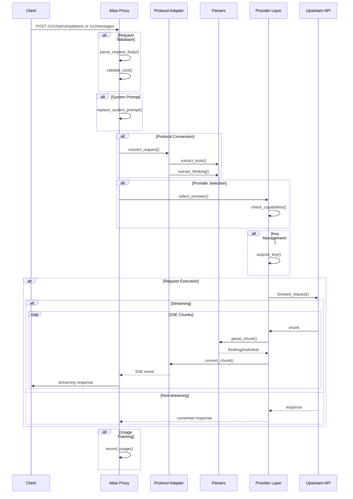
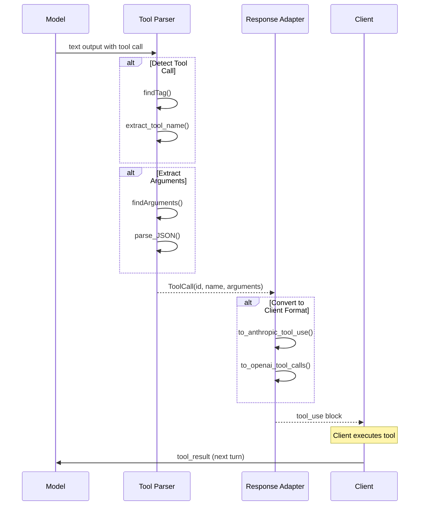

# Atlas Proxy Architecture Analysis

## Executive Summary

This document provides a comprehensive architectural comparison between Atlas Proxy (Python-based OpenAI-compatible proxy) and Ollama (Go-based local LLM server with multi-protocol support). The analysis identifies gaps, migration opportunities, and a recommended roadmap for evolving Atlas into a best-in-class multi-provider proxy with first-class Claude, Anthropic, OpenAI, and future provider compatibility.

---

## Architecture Overview

### Atlas Proxy Architecture

Atlas is a lightweight Python proxy designed to forward AI requests to NVIDIA's inference endpoints while providing OpenAI and Anthropic API compatibility. It operates as a single-provider gateway with key rotation, system prompt override, and token tracking.

```
┌─────────────────────────────────────────────────────────────────────┐
│                        Atlas Proxy (Python)                          │
├─────────────────────────────────────────────────────────────────────┤
│                                                                      │
│  ┌──────────────┐    ┌──────────────┐    ┌───────────────────┐    │
│  │  FastAPI     │───▶│  Adapters    │───▶│  NVIDIA Client    │    │
│  │  Server      │    │  Layer       │    │  (httpx)          │    │
│  │              │    │              │    │                   │    │
│  │ /v1/chat    │    │ openai_compat│    │ ┌─────────────┐  │    │
│  │ /v1/messages│    │ anthropic_   │    │ │ Key Store   │  │    │
│  │ /v1/models  │    │ adapter      │    │ │ (rotation)  │  │    │
│  │ /health     │    │ internal.py  │    │ └─────────────┘  │    │
│  │ /stats      │    │              │    │                   │    │
│  └──────────────┘    └──────────────┘    └───────────────────┘    │
│         │                    │                     │                 │
│         │                    │                     │                 │
│  ┌──────────────┐    ┌──────────────┐    ┌───────────────────┐    │
│  │  Stats       │    │  System      │    │  Request          │    │
│  │  Tracking    │    │  Prompt      │    │  Pipeline         │    │
│  │              │    │  Override    │    │                   │    │
│  │ stats.py     │    │ system_     │    │ Streaming +       │    │
│  │              │    │ prompt.py   │    │ Keepalive        │    │
│  └──────────────┘    └──────────────┘    └───────────────────┘    │
│                                                                      │
└─────────────────────────────────────────────────────────────────────┘
```

**Technology Stack:**
- **Framework:** FastAPI + Uvicorn
- **HTTP Client:** httpx with HTTP/2 support
- **Data Types:** Python dataclasses
- **Configuration:** Environment variables + .env file

**Key Files:**
| File | Purpose |
|------|---------|
| `atlas_proxy.py` | Main FastAPI server, request routing |
| `openai_compat.py` | OpenAI ↔ Anthropic protocol translation |
| `anthropic_adapter.py` | Anthropic Messages API conversion |
| `internal.py` | Canonical internal message types |
| `nvidia_client.py` | NVIDIA API HTTP client |
| `nvidia_key_store.py` | API key rotation with cooldown |
| `stats.py` | Persistent request/usage statistics |
| `system_prompt.py` | System prompt override injection |

---

### Ollama Architecture

Ollama is a comprehensive Go-based local LLM inference server with native model execution, multi-protocol compatibility (OpenAI, Anthropic), and built-in tool calling and reasoning support.

```
┌──────────────────────────────────────────────────────────────────────┐
│                        Ollama Server (Go)                             │
├──────────────────────────────────────────────────────────────────────┤
│                                                                       │
│  ┌───────────────────────────────────────────────────────────────┐   │
│  │                    HTTP Routes (Gin)                         │   │
│  │                                                               │   │
│  │   /api/generate    /api/chat    /api/embeddings    /models   │   │
│  │   /v1/chat/completions (OpenAI compat)                       │   │
│  │   /v1/messages (Anthropic compat)                             │   │
│  └───────────────────────────────────────────────────────────────┘   │
│                                 │                                    │
│                                 ▼                                    │
│  ┌───────────────────────────────────────────────────────────────┐   │
│  │              Protocol Adapters                               │   │
│  │                                                               │   │
│  │  ┌─────────────┐  ┌─────────────┐  ┌─────────────────────┐ │   │
│  │  │ openai.go   │  │anthropic.go │  │ api/types.go        │ │   │
│  │  │ (OpenAI)    │  │(Anthropic)  │  │ (Internal Types)    │ │   │
│  │  └─────────────┘  └─────────────┘  └─────────────────────┘ │   │
│  └───────────────────────────────────────────────────────────────┘   │
│                                 │                                    │
│                                 ▼                                    │
│  ┌───────────────────────────────────────────────────────────────┐   │
│  │              Core Pipeline                                  │   │
│  │                                                               │   │
│  │  ┌──────────────┐  ┌─────────────┐  ┌──────────────────┐  │   │
│  │  │ Scheduler    │  │ Model       │  │ Runner           │  │   │
│  │  │ (sched.go)  │  │ Management  │  │ (llama_server)   │  │   │
│  │  │              │  │             │  │                  │  │   │
│  │  │ Request      │  │ Manifest    │  │ Local inference  │  │   │
│  │  │ Queueing     │  │ Loading     │  │ (llama.cpp)     │  │   │
│  │  └──────────────┘  └─────────────┘  └──────────────────┘  │   │
│  └───────────────────────────────────────────────────────────────┘   │
│                                 │                                    │
│                                 ▼                                    │
│  ┌───────────────────────────────────────────────────────────────┐   │
│  │              Parsers                                        │   │
│  │                                                               │   │
│  │  ┌─────────────┐  ┌─────────────┐  ┌─────────────────────┐ │   │
│  │  │ tools.go    │  │thinking/    │  │ template.go        │ │   │
│  │  │ (Tool Call │  │parser.go    │  │ (Prompt Template)  │ │   │
│  │  │  Parsing)  │  │(Reasoning)  │  │                    │ │   │
│  │  └─────────────┘  └─────────────┘  └─────────────────────┘ │   │
│  └───────────────────────────────────────────────────────────────┘   │
│                                                                       │
└──────────────────────────────────────────────────────────────────────┘
```

**Technology Stack:**
- **Framework:** Go + Gin web framework
- **HTTP:** Native Go net/http
- **LLM Inference:** llama.cpp (via llm package)
- **Protocols:** OpenAI REST API, Anthropic Messages API
- **Data Types:** Go structs with JSON tags

**Key Files:**
| File | Purpose |
|------|---------|
| `server/routes.go` | HTTP handlers for all endpoints |
| `server/sched.go` | Request scheduling and model loading |
| `llm/llama_server.go` | Local model inference runner |
| `openai/openai.go` | OpenAI API compatibility |
| `anthropic/anthropic.go` | Anthropic API compatibility |
| `api/types.go` | Core request/response types |
| `tools/tools.go` | Tool call parser |
| `thinking/parser.go` | Reasoning/thinking block parser |

---

## Side-by-Side Comparison

### Request Flow Comparison

#### Atlas Proxy Request Flow

```
Client Request (OpenAI or Anthropic format)
         │
         ▼
┌─────────────────────────────┐
│  FastAPI Endpoint           │
│  /v1/chat/completions      │
│  /v1/messages              │
└─────────────────────────────┘
         │
         ▼
┌─────────────────────────────┐
│  parse_request_body()      │
│  + Body validation        │
│  + Size limits            │
└─────────────────────────────┘
         │
         ▼
┌─────────────────────────────┐
│  replace_system_prompt()  │
│  + Override injection      │
│  + Junk stripping         │
└─────────────────────────────┘
         │
         ▼
┌─────────────────────────────┐
│  Protocol Conversion       │
│  (OpenAI ↔ Anthropic)     │
└─────────────────────────────┘
         │
         ▼
┌─────────────────────────────┐
│  Key Store acquire()      │
│  + Sticky key selection   │
│  + Cooldown management    │
└─────────────────────────────┘
         │
         ▼
┌─────────────────────────────┐
│  NVIDIA Client            │
│  + httpx request          │
│  + Streaming support      │
└─────────────────────────────┘
         │
         ▼
┌─────────────────────────────┐
│  Response Conversion       │
│  + SSE streaming           │
│  + Usage extraction       │
└─────────────────────────────┘
         │
         ▼
    Client Response
```

#### Ollama Request Flow

```
Client Request (OpenAI/Anthropic/Raw)
         │
         ▼
┌─────────────────────────────┐
│  Gin Router                │
│  + Path parsing            │
│  + Auth middleware        │
└─────────────────────────────┘
         │
         ▼
┌─────────────────────────────┐
│  Protocol Adapter          │
│  + FromMessagesRequest()  │
│  + FromChatRequest()      │
└─────────────────────────────┘
         │
         ▼
┌─────────────────────────────┐
│  Model Options            │
│  + Capability checking    │
│  + Option validation      │
└─────────────────────────────┘
         │
         ▼
┌─────────────────────────────┐
│  Scheduler                │
│  + Runner allocation      │
│  + Queue management       │
│  + Model loading          │
└─────────────────────────────┘
         │
         ▼
┌─────────────────────────────┐
│  LLM Runner               │
│  + llama.cpp inference    │
│  + Token streaming        │
│  + Tool call detection   │
└─────────────────────────────┘
         │
         ▼
┌─────────────────────────────┐
│  Response Adapter          │
│  + ToChatCompletion()     │
│  + ToChunks()             │
│  + SSE formatting         │
└─────────────────────────────┘
         │
         ▼
    Client Response
```

### Protocol Handling Comparison

| Feature | Atlas Proxy | Ollama |
|---------|-------------|--------|
| **OpenAI Chat Completions** | ✅ Full support | ✅ Full support |
| **Anthropic Messages** | ✅ Basic support | ✅ Full support |
| **Anthropic Streaming** | ✅ SSE conversion | ✅ Native SSE |
| **System Prompt** | ✅ Override injection | ✅ Native |
| **Multi-modal Input** | ❌ Not supported | ✅ Image support |
| **Thinking/Reasoning** | ⚠️ Stripped | ✅ Full support |
| **Tool Calling** | ⚠️ Basic conversion | ✅ Full parser |
| **Stop Sequences** | ✅ Basic | ✅ Advanced |
| **Usage Reporting** | ✅ Partial | ✅ Full |

### Streaming Implementation Comparison

#### Atlas Streaming

```python
# atlas_proxy.py - SSE streaming with keepalive
async def keepalive(iterator, interval):
    yield b": ping\n\n"  # Immediate ping
    while True:
        done, _ = await asyncio.wait({pending}, timeout=interval)
        if not done:
            yield b": keepalive\n\n"  # Keepalive comment
            continue
        yield chunk
```

**Characteristics:**
- Keepalive comments every 15 seconds
- Immediate ping on stream start
- SSE event forwarding
- Usage extraction from final chunk

#### Ollama Streaming

```go
// server/routes.go - streamResponse
func streamResponse(c *gin.Context, ch chan any) {
    c.Stream(func(w io.Writer) bool {
        if msg, ok := <-ch; ok {
            // Format as SSE
            c.SSEvent("message", msg)
            return true
        }
        return false
    })
}
```

**Characteristics:**
- Native Go channel-based streaming
- EventSource support
- No keepalive by default
- Full SSE event types

### Adapter Architecture Comparison

#### Atlas Adapters

```
┌─────────────────────────────────────────────────────┐
│                 openai_compat.py                     │
├─────────────────────────────────────────────────────┤
│  normalize_messages()         - Flatten messages    │
│  anthropic_messages_to_openai() - Convert request  │
│  openai_response_to_anthropic() - Convert response │
│  sanitize_openai_payload()     - Clamp params      │
│  openai_sse_to_anthropic_sse() - Stream convert   │
│  anthropic_sse_from_response()  - Generate SSE     │
└─────────────────────────────────────────────────────┘

┌─────────────────────────────────────────────────────┐
│                anthropic_adapter.py                 │
├─────────────────────────────────────────────────────┤
│  anthropic_to_internal()      - Request convert    │
│  StreamConverter               - State-based convert │
│  convert_openai_stream_to_anthropic() - Stream    │
│  generate_anthropic_sse()     - Generate events    │
└─────────────────────────────────────────────────────┘
```

#### Ollama Adapters

```
┌─────────────────────────────────────────────────────┐
│                 openai/openai.go                    │
├─────────────────────────────────────────────────────┤
│  ToChatCompletion()          - Response to OpenAI  │
│  ToChunks()                  - Streaming chunks    │
│  ToToolCalls()               - Tool call format    │
│  ToUsage()                   - Usage reporting     │
│  StreamOptions               - include_usage      │
└─────────────────────────────────────────────────────┘

┌─────────────────────────────────────────────────────┐
│               anthropic/anthropic.go                │
├─────────────────────────────────────────────────────┤
│  FromMessagesRequest()        - Convert request    │
│  ToMessagesResponse()         - Convert response   │
│  ContentBlock types           - Full block support │
│  Streaming events             - message_start     │
│                                 content_block_*    │
│                                 message_delta     │
└─────────────────────────────────────────────────────┘
```

---

## Missing Features Analysis

### Features Ollama Has That Atlas Lacks

#### 1. **Claude Request Translation**

| Aspect | Atlas | Ollama |
|--------|-------|--------|
| Request Format Conversion | Partial | Full |
| Content Block Handling | Basic | Complete |
| Multi-modal Support | ❌ | ✅ |
|thinking Block Support | ⚠️ Stripped | ✅ Full |

**Gap:** Atlas strips thinking blocks for Claude Code compatibility but doesn't provide a proper handling mechanism. Ollama maintains full thinking block state.

#### 2. **Anthropic ↔ OpenAI Adapters**

| Feature | Atlas | Ollama |
|---------|-------|--------|
| Error Type Mapping | Basic | Complete |
| Stop Reason Mapping | Basic | Complete |
| Usage Reporting | Partial | Full |
| Stream Options | Basic | Advanced |

**Gap:** Ollama maps all Anthropic error types (25+) while Atlas handles only the most common ones.

#### 3. **Tool Parser**

**Atlas:**
- Uses simple JSON parsing in `openai_response_to_anthropic()`
- No stateful parsing for incremental tool arguments
- Basic tool call accumulation

**Ollama** (`tools/tools.go`):
- Stateful `Parser` struct with buffer management
- Handles partial tool names and arguments
- Tag-based detection (`{`, `[`, custom tags)
- JSON argument parsing with fallback
- Multi-tool call support

```go
// Ollama tool parsing - advanced state machine
type Parser struct {
    tag   string
    tools []api.Tool
    state  toolsState  // LookingForTag, ToolCalling, Done
    buffer []byte
    n      int
}
```

#### 4. **Thinking/Reasoning Block Parser**

**Atlas:**
- Strips thinking blocks entirely
- No parser implementation
- `anthropic_adapter.py` has TODO comments about thinking

**Ollama** (`thinking/parser.go`):
- Full state machine for thinking block parsing
- Handles opening/closing tags
- Whitespace management
- Partial tag detection

```go
// Ollama thinking parser - complete state machine
type Parser struct {
    state       thinkingState
    OpeningTag  string
    ClosingTag  string
    acc         strings.Builder
}
```

#### 5. **Request Validation**

**Atlas:**
- Basic size validation in `parse_request_body()`
- No capability checking
- No model availability validation

**Ollama:**
- Model capability checking (`CheckCapabilities()`)
- Context length validation
- Option validation with defaults
- Multi-GPU support

#### 6. **Model Abstraction**

**Atlas:**
- Single hardcoded model (configurable via env)
- No model registry
- No capability system

**Ollama:**
- Full model registry (`/api/models` endpoint)
- Model manifest system
- Capability system (Vision, Embedding, Thinking, etc.)
- Multiple model families

#### 7. **Provider Abstraction**

**Atlas:**
- Single provider (NVIDIA)
- No provider abstraction layer
- Hardcoded API endpoints

**Ollama:**
- Local inference (llama.cpp, llama.cpp, MLX)
- Remote model support
- Cloud proxy capability
- Extensible architecture

#### 8. **Connection Management**

**Atlas:**
- HTTP/2 connection pooling
- Keepalive support
- Basic timeout handling

**Ollama:**
- Model runner lifecycle management
- GPU memory tracking
- Automatic model eviction
- Queue management with max pending

#### 9. **Logging & Observability**

**Atlas:**
- Basic structured logging (JSON + pretty)
- Request/response logging
- Token statistics

**Ollama:**
- Structured logging with context
- Request logging with timing
- Debug info support
- Metrics integration

---

## Feature Gap Summary Table

| Feature Category | Feature | Atlas | Ollama | Priority |
|----------------|---------|-------|--------|----------|
| **Protocol** | OpenAI Chat Completions | ✅ Full | ✅ Full | - |
| **Protocol** | Anthropic Messages | ✅ Basic | ✅ Full | Medium |
| **Protocol** | SSE Streaming | ✅ Full | ✅ Full | - |
| **Protocol** | Usage Reporting | ⚠️ Partial | ✅ Full | High |
| **Tools** | Tool Definition | ✅ Basic | ✅ Full | - |
| **Tools** | Tool Call Parsing | ⚠️ Basic | ✅ Full | High |
| **Tools** | Tool Result Conversion | ✅ Basic | ✅ Full | Medium |
| **Thinking** | thinking Block Support | ❌ Stripped | ✅ Full | High |
| **Thinking** | Thinking Parser | ❌ None | ✅ Full | High |
| **Model** | Model Registry | ❌ None | ✅ Full | High |
| **Model** | Capability System | ❌ None | ✅ Full | Medium |
| **Provider** | Multi-Provider Support | ❌ None | ⚠️ Local only | High |
| **Provider** | Provider Abstraction | ❌ None | ✅ Partial | High |
| **Auth** | API Key Management | ⚠️ File-based | ⚠️ Basic | Low |
| **Validation** | Request Validation | ⚠️ Basic | ✅ Full | Medium |
| **Streaming** | Keepalive Support | ✅ Full | ❌ None | Low |
| **Logging** | Structured Logging | ✅ Basic | ✅ Full | Low |

---

## Migration Opportunities

### Features That Can Be Copied Directly

#### 1. **Thinking Parser** (`thinking/parser.go`)

**Complexity:** Medium  
**Dependencies:** None  
**Risk:** Low

Ollama's thinking parser is a self-contained state machine. It can be ported to Python directly.

```python
# Recommended implementation location: proxy/thinking_parser.py
# Follow Ollama's state machine pattern
class ThinkingParser:
    def __init__(self, opening_tag="<thinking>", closing_tag="</thinking>"):
        self.state = ThinkingState.LOOKING_FOR_OPENING
        self.opening_tag = opening_tag
        self.closing_tag = closing_tag
        self.buffer = ""
```

#### 2. **Tool Parser** (`tools/tools.go`)

**Complexity:** Medium  
**Dependencies:** None  
**Risk:** Low

The tool parser can be ported as-is. It's a self-contained parser with no external dependencies beyond the API types.

```python
# Recommended implementation location: proxy/tool_parser.py
# Follow Ollama's buffer management pattern
class ToolParser:
    def __init__(self, tools: list[ToolDefinition], tag: str = "{"):
        self.tools = tools
        self.tag = tag
        self.state = ToolParserState.LOOKING_FOR_TAG
        self.buffer = ""
```

#### 3. **Error Type Mapping**

**Complexity:** Low  
**Dependencies:** None  
**Risk:** None

Ollama has comprehensive error type mapping for both OpenAI and Anthropic. This can be directly copied.

**Current Atlas:** 6 error types  
**Ollama:** 25+ error types with proper HTTP status mapping

```python
# Add to openai_compat.py
ERROR_TYPE_MAP = {
    400: "invalid_request_error",
    401: "authentication_error", 
    403: "permission_error",
    404: "not_found_error",
    408: "request_timeout",
    409: "conflict_error",
    413: "request_too_large",
    422: "invalid_request_error",
    429: "rate_limit_error",
    500: "internal_error",
    502: "bad_gateway",
    503: "service_unavailable",
    504: "gateway_timeout",
    # ... extended mapping
}
```

#### 4. **Stream Options** (`include_usage`)

**Complexity:** Low  
**Dependencies:** None  
**Risk:** None

Ollama's `StreamOptions` with `include_usage` is already partially implemented in Atlas but could be extended.

### Features That Need Adapting

#### 1. **Protocol Adapters** (OpenAI/Anthropic)

**Complexity:** High  
**Dependencies:** Internal types  
**Risk:** Medium

Ollama's adapter architecture is more comprehensive. The conversion logic in `openai/openai.go` and `anthropic/anthropic.go` handles more edge cases.

**Recommended approach:**
1. Expand `internal.py` to match Ollama's `api/types.go` richness
2. Add more complete error handling
3. Implement Ollama's content block types

#### 2. **Streaming Response Handling**

**Complexity:** Medium  
**Dependencies:** SSE library  
**Risk:** Low

Ollama uses Go channels for streaming. Python's async generators are conceptually similar but need adaptation.

**Atlas current:** Manual SSE formatting  
**Ollama:** EventSource with named events

```python
# Enhanced SSE in openai_compat.py
async def sse_event(event_type: str, data: dict) -> bytes:
    return f"event: {event_type}\ndata: {json.dumps(data)}\n\n".encode()
```

#### 3. **Model Capability System**

**Complexity:** High  
**Dependencies:** Model registry  
**Risk:** Medium

Ollama's capability system requires a model registry. Atlas doesn't have this abstraction yet.

**Recommended approach:**
1. Create a `models.py` module with model registry
2. Define capability enum (Vision, Embedding, Thinking, etc.)
3. Add capability checking before requests

### Features That Should NOT Be Copied

#### 1. **Local LLM Inference** (llama.cpp)

**Reason:** Atlas is a proxy, not a local inference engine. Ollama's `llm/llama_server.go` and GPU management is irrelevant for Atlas's use case.

#### 2. **Scheduler** (sched.go)

**Reason:** Ollama's scheduler manages local model loading and GPU allocation. Atlas forwards to external providers, so this is not applicable.

#### 3. **Cloud Proxy** (server/cloud_proxy.go)

**Reason:** This is Ollama-specific for their cloud offering. Atlas's key rotation approach is simpler and appropriate for its use case.

#### 4. **Authentication** (server/auth.go)

**Reason:** Ollama has built-in auth. Atlas currently operates on localhost without auth, which is appropriate for its design.

---

## Recommended Architecture

### Target Architecture

```
┌─────────────────────────────────────────────────────────────────────────────┐
│                        Atlas Proxy (Enhanced)                              │
├─────────────────────────────────────────────────────────────────────────────┤
│                                                                             │
│  ┌─────────────────────────────────────────────────────────────────────┐   │
│  │                    Protocol Layer                                   │   │
│  │                                                                      │   │
│  │  ┌──────────────┐  ┌──────────────┐  ┌──────────────────────┐    │   │
│  │  │ OpenAI       │  │ Anthropic    │  │ Future Providers     │    │   │
│  │  │ Adapter      │  │ Adapter      │  │ (Google, AWS, etc)  │    │   │
│  │  │              │  │              │  │                      │    │   │
│  │  │ + Compatible │  │ + Full       │  │ + Provider interface │    │   │
│  │  │ + Streaming  │  │ + Thinking   │  │ + Key management    │    │   │
│  │  │ + Tools     │  │ + Tools      │  │                      │    │   │
│  │  └──────────────┘  └──────────────┘  └──────────────────────┘    │   │
│  └─────────────────────────────────────────────────────────────────────┘   │
│                                    │                                        │
│                                    ▼                                        │
│  ┌─────────────────────────────────────────────────────────────────────┐   │
│  │                    Internal Types (Canonical)                       │   │
│  │                                                                      │   │
│  │  Request  Message  ContentBlock  ToolCall  ToolDefinition  Response   │   │
│  │  Usage  Options  Model  Provider  Capability                        │   │
│  │                                                                      │   │
│  │  + Thinking support                                                 │   │
│  │  + Multi-modal content blocks                                       │   │
│  │  + Full content block types                                        │   │
│  └─────────────────────────────────────────────────────────────────────┘   │
│                                    │                                        │
│                                    ▼                                        │
│  ┌─────────────────────────────────────────────────────────────────────┐   │
│  │                    Parser Layer                                    │   │
│  │                                                                      │   │
│  │  ┌──────────────┐  ┌──────────────┐  ┌──────────────────────┐      │   │
│  │  │ Tool Parser  │  │ Thinking     │  │ Content Block       │      │   │
│  │  │              │  │ Parser       │  │ Parser              │      │   │
│  │  │ + State     │  │ + State     │  │                      │      │   │
│  │  │ + Buffer    │  │ + Tags      │  │ + Type detection    │      │   │
│  │  │ + JSON args │  │ + Partial   │  │ + Validation        │      │   │
│  │  └──────────────┘  └──────────────┘  └──────────────────────┘      │   │
│  └─────────────────────────────────────────────────────────────────────┘   │
│                                    │                                        │
│                                    ▼                                        │
│  ┌─────────────────────────────────────────────────────────────────────┐   │
│  │                    Provider Abstraction Layer                       │   │
│  │                                                                      │   │
│  │  ┌──────────────┐  ┌──────────────┐  ┌──────────────────────┐      │   │
│  │  │ NVIDIA       │  │ Anthropic    │  │ Provider Interface  │      │   │
│  │  │ Provider     │  │ Provider     │  │ (Abstract)         │      │   │
│  │  │              │  │              │  │                      │      │   │
│  │  │ + Key store │  │ + API client│  │ + Abstract methods  │      │   │
│  │  │ + Client    │  │ + Endpoints │  │ + Capability match │      │   │
│  │  │ + Fallback │  │              │  │                      │      │   │
│  │  └──────────────┘  └──────────────┘  └──────────────────────┘      │   │
│  └─────────────────────────────────────────────────────────────────────┘   │
│                                                                             │
│  ┌─────────────────────────────────────────────────────────────────────┐   │
│  │                    Core Infrastructure                               │   │
│  │                                                                      │   │
│  │  Stats  Logging  Config  Key Store  Model Registry                    │   │
│  │                                                                      │   │
│  └─────────────────────────────────────────────────────────────────────┘   │
│                                                                             │
└─────────────────────────────────────────────────────────────────────────────┘
```

---

## Implementation Roadmap

### Phase 1: Foundation (Week 1-2)

#### 1.1 Enhanced Internal Types (`internal.py`)

**Changes:**
- Add `ThinkingBlock` content type
- Add `ImageBlock` for multi-modal (future)
- Add `ServerToolUseBlock` for tool results
- Add capability enum
- Add provider enum
- Add model registry types

**Files to modify:**
- `proxy/internal.py`

#### 1.2 Error Type Mapping

**Changes:**
- Expand error type mapping to match Ollama
- Add HTTP status to error type conversion
- Add proper error response formatting

**Files to modify:**
- `proxy/openai_compat.py`

### Phase 2: Parsers (Week 2-3)

#### 2.1 Thinking Parser

**Changes:**
- Create `proxy/thinking_parser.py`
- Implement state machine for thinking blocks
- Handle partial tags
- Handle whitespace

**Files to create:**
- `proxy/thinking_parser.py`

#### 2.2 Tool Parser

**Changes:**
- Create `proxy/tool_parser.py`
- Implement state machine for tool calls
- Handle JSON argument parsing
- Handle tag-based detection
- Support multiple tool call formats

**Files to create:**
- `proxy/tool_parser.py`

### Phase 3: Adapter Enhancement (Week 3-4)

#### 3.1 Enhanced Anthropic Adapter

**Changes:**
- Full content block type support
- Thinking block preservation (configurable)
- Complete error mapping
- Enhanced streaming

**Files to modify:**
- `proxy/anthropic_adapter.py`
- `proxy/openai_compat.py`

#### 3.2 Streaming Enhancement

**Changes:**
- Named SSE events (like Ollama)
- Proper content block streaming
- Usage reporting in all streams

**Files to modify:**
- `proxy/openai_compat.py`

### Phase 4: Provider Abstraction (Week 4-5)

#### 4.1 Provider Interface

**Changes:**
- Create `proxy/providers/base.py` - abstract provider class
- Define standard interface: `chat()`, `stream_chat()`, `embed()`
- Add capability matching

**Files to create:**
- `proxy/providers/__init__.py`
- `proxy/providers/base.py`
- `proxy/providers/nvidia.py` (move from nvidia_client.py)

#### 4.2 Additional Providers

**Changes:**
- Anthropic API provider
- OpenAI API provider
- Fallback/routing logic

**Files to create:**
- `proxy/providers/anthropic.py`
- `proxy/providers/openai.py`

### Phase 5: Model Management (Week 5-6)

#### 5.1 Model Registry

**Changes:**
- Create `proxy/models.py`
- Define model capabilities
- Add `/v1/models` dynamic response
- Add model availability checking

**Files to create:**
- `proxy/models.py`

#### 5.2 Configuration

**Changes:**
- YAML-based model configuration
- Provider priority ordering
- Fallback chains

---

## Dependency Graph

```
┌─────────────────────────────────────────────────────────────────────────────┐
│                         Module Dependencies                                 │
└─────────────────────────────────────────────────────────────────────────────┘

atlas_proxy.py
    ├── openai_compat.py
    │   └── internal.py
    ├── anthropic_adapter.py
    │   └── internal.py
    ├── nvidia_client.py
    ├── nvidia_key_store.py
    ├── stats.py
    └── system_prompt.py

Proposed additions:

thinking_parser.py
    └── (no dependencies - self-contained)

tool_parser.py
    └── internal.py (ToolDefinition)

providers/
    ├── base.py (interface)
    │   └── internal.py
    ├── nvidia.py
    │   ├── nvidia_client.py
    │   └── nvidia_key_store.py
    ├── anthropic.py
    │   └── (new client)
    └── openai_provider.py
        └── (new client)

models.py
    └── (no dependencies - data types)
```

---

## Request Flow Diagrams

### Enhanced Request Flow



### Tool Calling Flow



---

## Risk Analysis

### Implementation Risks

| Risk | Likelihood | Impact | Mitigation |
|------|------------|--------|------------|
| Parser state machine bugs | Medium | High | Extensive testing with edge cases |
| Performance regression | Low | Medium | Benchmark before/after |
| Breaking existing clients | Low | High | Maintain backward compatibility |
| New provider integration issues | Medium | Medium | Abstract provider interface first |

### Complexity Estimates

| Module | Complexity | Est. Lines | Dependencies |
|--------|------------|------------|--------------|
| Thinking Parser | Medium | 200 | None |
| Tool Parser | Medium | 400 | internal.py |
| Provider Interface | Medium | 300 | internal.py |
| Anthropic Adapter v2 | High | 500 | All above |
| Model Registry | Medium | 200 | None |
| **Total New Code** | - | ~1,600 | - |

---

## Expected Improvements

After implementing this roadmap, Atlas will have:

1. **Full Claude Code compatibility** - Proper thinking block handling
2. **Robust tool calling** - State-based parser matching Ollama
3. **Multi-provider support** - Easy addition of new providers
4. **Enhanced observability** - Better error reporting
5. **Future-proof architecture** - Abstract layers for extension
6. **Model capability system** - Dynamic provider/model selection

---

## Conclusion

Atlas Proxy is currently a functional but limited single-provider proxy. Ollama provides a comprehensive reference architecture for protocol handling, tool calling, and thinking block parsing. The recommended migration path preserves Atlas's simplicity while adding the robustness needed for production use.

The key insight is that Atlas should **not** become Ollama (local inference is not the goal) but should **adopt** Ollama's patterns for:
- Protocol adapter architecture
- Tool call parsing
- Thinking block handling
- Error type mapping
- Content block types

The proposed architecture maintains Atlas's lightweight nature while adding the depth needed for full Claude/Anthropic/OpenAI compatibility.
